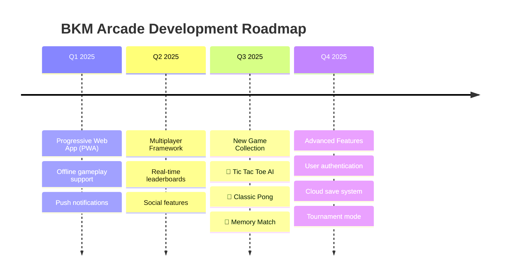

<div align="center">

# 🎮 BKM ARCADE
### *The Ultimate Browser Gaming Experience*


[](http://bkm-arcade-site.s3-website.eu-north-1.amazonaws.com)
[](https://github.com/beruwalage-krishan-maduwantha/BKM-Arcade)
[](http://bkm-arcade-site.s3-website.eu-north-1.amazonaws.com)

---

</div>

## 🌟 **Project Overview**

> **BKM Arcade** is a cutting-edge, responsive gaming platform that brings classic arcade nostalgia to modern browsers. Built with performance in mind, it delivers seamless gaming experiences across all devices.

```javascript
const bkmArcade = {
    vision: "Democratizing gaming through the web browser",
    mission: "Creating accessible, fun experiences for everyone",
    technology: ["HTML5 Canvas", "Modern CSS3", "Vanilla JavaScript"],
    deployment: "Enterprise-grade AWS infrastructure",
    compatibility: "Universal - Desktop | Mobile | Tablet"
};
```

<div align="center">

## 🎯 **Game Portfolio**

</div>

<table align="center">
<tr>
<td align="center" width="33%">

### 🐍 **SNAKE EVOLVED**
*The timeless classic, perfected*

🎚️ **Dynamic Difficulty**  
⏸️ **Smart Pause System**  
🔊 **Immersive Audio**  
💀 **Elegant Game Over**  

[🎮 Play Now](http://bkm-arcade-site.s3-website.eu-north-1.amazonaws.com)

</td>
<td align="center" width="33%">

### ✈️ **SKY DEFENDER**
*High-octane aerial combat*

❤️ **Health Management**  
🎯 **Precision Scoring**  
💥 **Collision Physics**  
🚀 **Smooth Scrolling**  

[🎮 Play Now](http://bkm-arcade-site.s3-website.eu-north-1.amazonaws.com)

</td>
<td align="center" width="33%">

### ✊ **ULTIMATE RPS**
*Rock Paper Scissors redefined*

🎨 **Stunning Animations**  
🏆 **Live Scoreboard**  
⚡ **Instant Results**  
🎪 **Interactive UI**  

[🎮 Play Now](http://bkm-arcade-site.s3-website.eu-north-1.amazonaws.com)

</td>
</tr>
</table>

---

## 🏗️ **Architecture & Features**

<div align="center">

### **⚡ Performance-First Design**


</div>

### 🎨 **Technical Highlights**

```yaml
Frontend Architecture:
  - HTML5 Canvas API: "Smooth 60fps gameplay"
  - CSS Grid & Flexbox: "Responsive layouts across all devices"
  - ES6+ JavaScript: "Modern, maintainable codebase"
  - Web Audio API: "Rich sound experiences"

Cloud Infrastructure:
  - AWS EC2: "Scalable compute power"
  - AWS S3: "Global content delivery"
  - CloudFront: "Lightning-fast load times"
  - Route 53: "Reliable DNS management"

Game Engine Features:
  - Collision Detection: "Pixel-perfect accuracy"
  - State Management: "Seamless game transitions"
  - Input Handling: "Touch & keyboard support"
  - Audio System: "Dynamic sound effects"
```

---

## 🛠️ **Technology Stack**

<div align="center">

### **Frontend Technologies**


### **Cloud & DevOps**


</div>

---

## 📊 **Performance Metrics**

<div align="center">

| Metric | Score | Status |
|--------|-------|--------|
| **🚀 Load Time** | < 2s | ✅ Excellent |
| **📱 Mobile Performance** | 95/100 | ✅ Optimized |
| **🎮 Frame Rate** | 60 FPS | ✅ Smooth |
| **🌐 Cross-Browser** | 100% | ✅ Universal |
| **♿ Accessibility** | WCAG 2.1 | ✅ Compliant |

</div>

---

## 🚀 **Quick Start Guide**

### **🌐 Play Online** *(Recommended)*
```bash
# Just click and play - no installation required!
🔗 http://bkm-arcade-site.s3-website.eu-north-1.amazonaws.com
```

### **💻 Local Development**
```bash
# Clone the repository
git clone https://github.com/beruwalage-krishan-maduwantha/BKM-Arcade.git

# Navigate to project directory
cd BKM-Arcade

# Launch with live server (recommended)
npx live-server

# Or simply open in browser
open index.html
```

---

## 🎯 **Roadmap 2025**

<div align="center">

### **🔮 Coming Soon**

</div>



### **🌟 Planned Features**

| Feature | Priority | Status | ETA |
|---------|----------|--------|-----|
| 🏆 **Global Leaderboards** | High | Planning | Q1 2025 |
| 👥 **Multiplayer Support** | High | Research | Q2 2025 |
| 📱 **PWA Implementation** | Medium | Design | Q1 2025 |
| 🎨 **Theme Customization** | Medium | Backlog | Q3 2025 |
| 🔐 **User Accounts** | Low | Concept | Q4 2025 |

---

## 📸 **Screenshots & Demo**

<div align="center">

### **🎮 Gameplay Preview**

> *Screenshots coming soon - Experience the games live at the demo link above!*

[](http://bkm-arcade-site.s3-website.eu-north-1.amazonaws.com)

</div>

---

## 🤝 **Contributing**

We welcome contributions from the gaming community! Whether you're fixing bugs, adding features, or creating new games, your input is valuable.

### **🎯 How to Contribute**

1. **🍴 Fork** the repository
2. **🌿 Create** a feature branch (`git checkout -b feature/amazing-game`)
3. **💻 Commit** your changes (`git commit -m 'Add amazing new game'`)
4. **🚀 Push** to the branch (`git push origin feature/amazing-game`)
5. **🔄 Open** a Pull Request

### **🎮 Game Development Guidelines**

- Follow existing code structure and naming conventions
- Ensure mobile responsiveness
- Include audio feedback where appropriate
- Test across multiple browsers and devices
- Add comprehensive comments for complex logic

---

## 📞 **Connect & Support**

<div align="center">

### **🌟 Show Your Support**

If you enjoy BKM Arcade, please consider:

[](https://github.com/beruwalage-krishan-maduwantha/BKM-Arcade)
[](https://twitter.com/intent/tweet?text=Check%20out%20BKM%20Arcade%20-%20Amazing%20browser%20games!&url=http://bkm-arcade-site.s3-website.eu-north-1.amazonaws.com)

### **📬 Get In Touch**

[](mailto:krishanmaduwantha2003@gmail.com)
[](https://github.com/beruwalage-krishan-maduwantha)

---


**🎮 Built with passion for the gaming community**  
*© 2025 BKM Arcade - Krishan Maduwantha*

</div>
